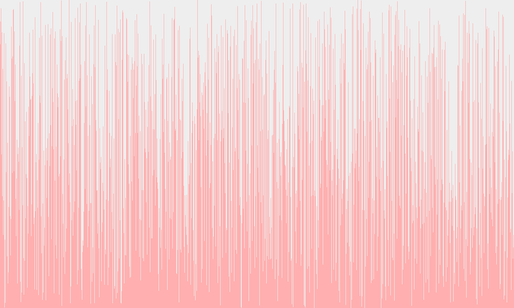
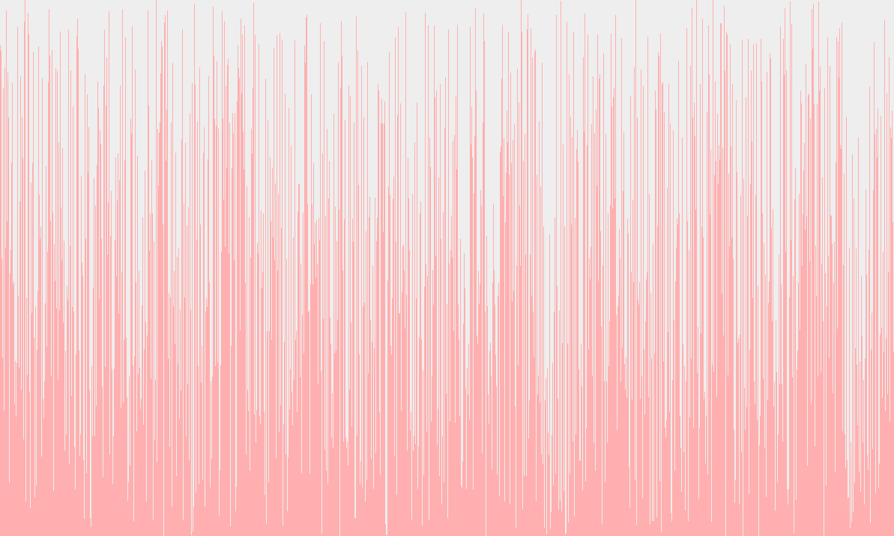
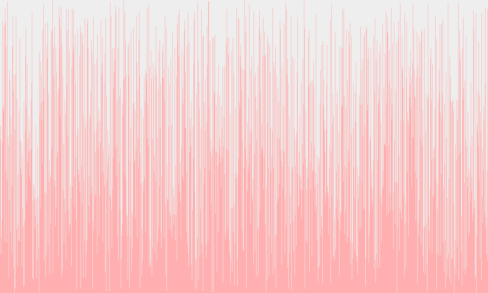
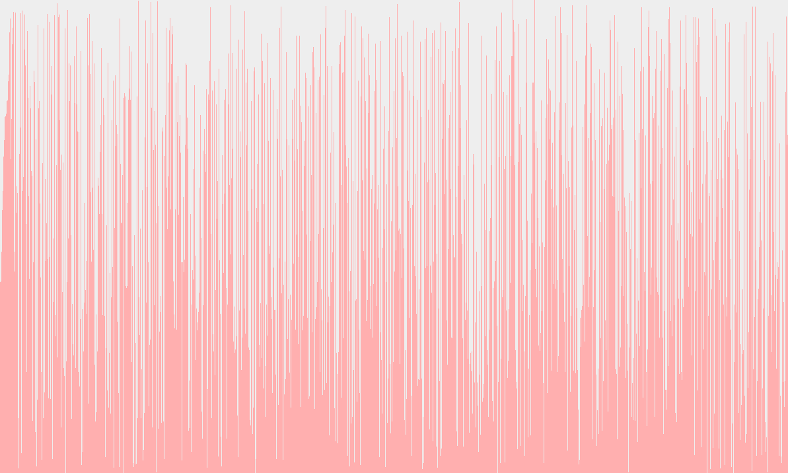

# Sorting Algorithm Visualizer
Sorting Algorithm Visualizer programmed in Java. Contains multiple different sorting algorithms which can be changed in the project code.

*Note - To change the sorting algorithm go into the VisualGUI class and change the variable sortType to SortType.desired_type*

## Bubble Sort Algorithm - Easy
Bubble Sort works by repeatedly swapping the adjacent elements if they are in wrong order.
Time complexity analysis:

|Worst Case|Average Case|Best Case|
|---|---|---|
|O(n2)|Θ(n2)|Ω(n)|

## Selection Sort Algorithm - Easy
Selection Sort works by repeatedly finding the minimum element from the unsorted part of the array then putting it at the beginning of the sorted array.
Time complexity analysis:

|Worst Case|Average Case|Best Case|
|---|---|---|
|O(n2)|Θ(n2)|Ω(n2)|

## Insertion Sort Algorithm - Easy
Insertion Sort works by virtually splitting the array into a sorted and an unsorted part. Values from the unsorted part are picked and placed at the correct position in the sorted part.
Time complexity analysis:

|Worst Case|Average Case|Best Case|
|---|---|---|
|O(n2)|Θ(n2)|Ω(n)|

## Merge Sort Algorithm - Medium
Merge Sort works by:
1. Divide the unsorted list into n sublists, each containing 1 element (a list of 1 element is considered sorted).
2. Repeatedly merge sublists to produce new sorted sublists until there is only 1 sublist remaining. This will be the sorted list.
Time complexity analysis:

|Worst Case|Average Case|Best Case|
|---|---|---|
|O(n log(n))|Θ(n log(n))|Ω(n log(n))|

